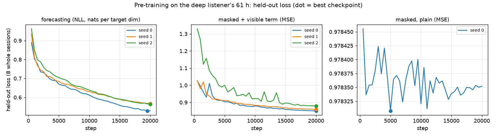

# NeuroCast

**Forecasting the brain as a foundation for decoding it.**

A stimulus-conditioned, subject-in-context predictive model of brain dynamics —
built so that the same artifact serves as a pretraining objective, a measurement
instrument, and the forward model of a decoder.

---

## 1. The idea in one page

Non-invasive brain decoding is stuck on one problem and quietly compromised by a
second.

**Stuck.** Decoders work *within* a subject and collapse *across* subjects. On
identical 50-word decoding from MEG, a within-subject supervised model reaches
**73.23% BAcc@10** while the best cross-subject self-supervised model reaches
**42.96%**. Every brain foundation model retrains or fine-tunes per subject.

**Compromised.** A wave of 2026 audits shows much of the reported progress is
shortcut learning:

- *The Identity Trap* ([arXiv 2606.06647]) — frozen subject-identity variance is
  **13–89× a random null in 12/12 model-dataset pairs**, and fine-tuning makes it
  **worse (+10 to +63pp)**. Removing the aperiodic 1/f component drops the
  subject probe by 9–19pp: 1/f is a subject fingerprint.
- Brain-to-language retrieval — signal-blind **Gaussian noise scores 66.3%
  Rank@1** under the field's standard variable-length protocol
  ([arXiv 2605.24524]).
- MOABB's large reproducibility study — deep learning still hasn't clearly beaten
  2010s Riemannian methods ([arXiv 2404.15319]).

**The bet.** Both problems have one cause: the field trains **classifiers**, and
a classifier is free to solve its task however it can. Identity is the cheapest
shortcut available. Train a **forecaster** instead — a model of *what this brain
will do next* — and the shortcut stops paying, because the target changes every
millisecond and depends on the stimulus.

This is not a hunch. The Sept-2026 *Roadmap for MEG Foundation Models*
([arXiv 2609.04461]) states verbatim that for pretraining objectives **"the
decisive comparison at matched data, compute and architecture is still
missing"**, that JEPA-style latent prediction for MEG is **"completely
unexplored"**, and that MEG scaling laws are **"not yet done"**.

### Falsifiable claims

| | Claim | Kill condition |
|---|---|---|
| **H1** | At matched data/compute/architecture, forecasting transfers better than masked reconstruction | masking wins or ties on both axes across ≥2 of 3 compute tiers, 3 seeds |
| **H2** | Forecasting starves the identity shortcut — lower FMScope subject-variance than masked models | forecasting arms leak as much as masked arms — **met**: forecasting leaks 6–8× *more* after single-listener pre-training (§2.2, LibriBrain) and 8–11× more about *unseen* people after 20-listener pre-training (§2.3, MEG-MASC), 3 seeds each |
| **H3** | The subject is a *prompt*, not a fine-tune: K minutes in-context ≥ fine-tuning on the same K minutes | prompting underperforms LoRA by >3pp BAcc@10 at K ∈ {10,20,40} min |
| **H4** | The forecaster inverts into a decoder via noisy-channel inference with an LLM prior | see §13 — R1 is measured, and two of the design's three mitigations failed |
| **H5** | Geometry conditioning transfers MEG→EEG/OPM/iEEG without retraining | training from scratch on the target array matches or beats zero-shot transfer (the Phase-3 gate; rehearsal in §16) |

Plus one deliverable that is **architecture-independent and survives all five
failing**: the **Neural Predictability Atlas** — how many bits of a human brain's
future are knowable, by horizon, band, region, and conditioning set. The
information-theoretic framework exists ([arXiv 2603.27074]) and has never been
applied to human M/EEG. Its estimators are built and validated against analytic
answers (§14).

**Mechanism for H2.** A subject's nuisance structure — 1/f slope, head position,
sensor coupling — is *visible in the context window*. A model that can read it
from the prompt has no incentive to store it in weights. And the corpus is too
small to memorise 800 subjects anyway (§7).

---

## 2. Status

**Phase 0 is built and validated against ground truth, on synthetic data**, and
the lost version's real-data audit has been re-run on LibriBrain100 (§2.1). The
rule held throughout: the leakage harness shipped before anything it might have
to audit. Every module below has a script that constructs a case with a known
answer, including cases that *are* leaky, and asserts the code reaches it. A
guard that never fires is not a guard.

| Module | What it is | Validated by |
|---|---|---|
| `audit/surrogates.py`, `audit/controls.py` | null-control suite: surrogates, permutation null, pass/fail table | `validate_controls.py` |
| `audit/fmscope.py` | subject-identity leakage (the H2 metric) | `run_bakeoff.py` |
| `data/canonical.py` | INV-1: frozen observation space, `log\|det J\|` bookkeeping | `validate_canonical.py` |
| `data/splits.py` | temporal / subject / stimulus disjointness, fingerprints | `validate_splits.py` |
| `data/paths.py` | where data lives: absolute, on the right disk, caches off C: | `validate_paths.py`, `data_setup.py check` |
| `data/synthetic.py` | identity-strong, label-weak corpus with known answer | `run_bakeoff.py` |
| `data/sources.py` | source-space corpus: one brain, any sensor array | `validate_generative.py`, `run_transfer.py` |
| `tokenizer/` | montage-agnostic front-end, exact AR factorisation | `validate_tokenizer.py` |
| `models/backbone.py`, `models/heads.py` | causal stack; mixture density + arm heads | `validate_backbone.py` |
| `models/conditioning.py` | subject prompt encoder; banded stimulus cross-attention | `validate_conditioning.py` |
| `models/neurocast.py` | the assembled model; input masking for the masked arms | `validate_backbone.py` section 8 |
| `models/forecast.py` | autoregressive rollout, group by group | `validate_generative.py` |
| `objectives/arms.py` | the five bake-off arms | `validate_backbone.py` |
| `train/flops.py` | measured FLOP accounting, HPO charged per arm | `validate_flops.py` |
| `train/loop.py` | bake-off loop under a measured budget | `validate_backbone.py` section 8, `run_bakeoff.py` |
| `train/targets.py`, `train/generative.py` | invertible quadrant-PCA targets; flagship trainer | `validate_generative.py` |
| `adapt/episodes.py`, `adapt/nuisance.py` | episodic sampler, guard bands; 1/f + band-power descriptors | `validate_adapt.py` |
| `decode/metrics.py`, `decode/scorer.py` | BAcc@k; noisy-channel scorer, λ calibration | `validate_decode.py` |
| `atlas/estimators.py`, `atlas/filters.py`, `atlas/stats.py` | forecastability estimators, causal filters, dependent-data inference | `validate_atlas.py` |
| `eval/references.py` | INV-1's reference rows: PSD-matched null, AR(16), white | `validate_eval.py` |
| `viz/topomap.py` | topographic maps; the real-vs-forecast movie | `validate_viz.py`, `run_demo.py` |
| `data/libribrain.py`, `data/megin.py` | LibriBrain runs (incl. the partial releases pnpl misses), windows; real 306-sensor geometry | `validate_libribrain.py` |
| `data/megmasc.py` | MEG-MASC word events in the same word table; KIT recordings filtered, resampled, cached; a KIT montage in head coordinates from the digitised head positions | `validate_libribrain.py` §10, `run_megmasc_*.py` |
| `decode/words.py`, `decode/baselines.py`, `decode/decoders.py`, `decode/covariates.py` | 50-word task, no-brain baselines, the pitch's four brain decoders plus EEGNet and a subject CNN, word loudness | `validate_libribrain.py`, `run_libribrain_audit.py` |
| `audit/fake_signals.py`, `audit/timing_matched.py`, `audit/collapse.py` | onset-only control; timing-matched test; nats beyond covariates; masked-collapse diagnostic | `validate_libribrain.py`; collapse: `validate_pretrain.py` |
| `train/pretrain.py` | real-data pre-training: warm-up + cosine, mixed precision, bit-exact resume | `validate_pretrain.py`, `run_pretrain_pilot.py` |

### Not built yet

Stated plainly, so nobody reads the table above as more than it is:

- **A general real-data loader.** LibriBrain's word windows, canonical arrays and
  real sensor geometry exist (`data/libribrain.py`, `data/megin.py`) and the
  audit runs on them, but recordings are not yet expressed as `Segment`s that
  `splits.py` guards, and no other corpus is wired in.
- **The Phase-2 trainer.** `EpisodeSampler` and `PromptEncoder` are each built and
  validated, but no training loop joins them to the backbone, and the H3
  comparators (embedding / LoRA / full fine-tune at matched minutes) do not exist.
- **The decoder on a trained forecaster.** `decode/` is validated on synthetic
  Gaussian class likelihoods; it has not been fed a NeuroCast likelihood or a real
  language model.
- **MEG-XL reproduction** and FMScope on its checkpoint.
- **Mamba-2 blocks** — `SSMBlock` is an interface stub (§17).
- **The Atlas production run** — the estimators are validated; no pipeline runs
  them over recordings by horizon, band and region.

### 2.1 Real data — the lost version, re-verified

An earlier, further-along NeuroCast was lost after 29 September 2026. Its faculty
pitch ([`docs/recovered/neurocast-pitch.html`](docs/recovered/neurocast-pitch.html))
is the only record, quoting real-data results from a README section that no
longer exists. Every checkable number in it was re-measured with this code on
freshly downloaded LibriBrain100. Claims were never edited to fit; the full
ledger — each claim, the re-measured value, a verdict — is
[`docs/recovered/VERIFICATION.md`](docs/recovered/VERIFICATION.md).

50 words, 32 listeners, fit chapter 11, test chapter 12 (32,198 / 32,251
MEG-covered trials — the pitch's counts exactly). BAcc@1 / BAcc@10, chance
0.02 / 0.20.

| | Pitch | Re-measured | |
|---|---|---|---|
| speech timing only — **no brain data** | 0.15–0.18 / 0.61–0.67 | 0.166 / 0.666 | ✅ |
| language model + timing — no brain data | ~0.35 / 0.80 | 0.372 / 0.818 | ✅ |
| linear decoder | 0.027 / 0.257 | 0.031 / 0.259 | ≈ |
| linear, one per person | 0.028 / 0.245 | 0.027 / 0.245 | ✅ |
| MLP | 0.036 / 0.278 | 0.034 / 0.268 | ≈ |
| CNN on the raw 125 Hz signal | 0.044 / 0.298 | 0.042 / 0.301 | ✅ |
| onset-only fake signal: share of the linear gain | 21–53% | 28% | ✅ |
| linear gain surviving the timing-matched test | about half | 52% (timing-only scorer: 21%) | ✅ |
| word information beyond timing, length, loudness: CNN / linear | 5× | 4.1× | ≈ |
| … the best decoder, nats per word | ~0.01 | 0.031 (CNN) | ❌ higher |
| phase-scrambled input | near chance (~0.217) | 0.236 as first run; 0.201 once each window's mean is removed too | ✅ after the fix |
| … each window's mean alone (constant in time) | — | 0.240 — **67% of the linear gain** | new |
| person information, raw signal (identity audit, word windows) | 3× | 1.8× (64 ms patch means, N = 8,000) | ❌ |

Pre-training pilot (§6 of the ledger): 6m rung (24.9M), the deep listener's 47.5 min, 4,000 steps per arm at 0.21–0.25 s/step on the RTX 3050.

| | Pitch | Re-measured | |
|---|---|---|---|
| masked model collapsed on real data | output ignored input | spread 0.000, sensitivity to context 0.000 | ✅ |
| … also at a lower learning rate | still collapsed | lr 3e-4: collapsed | ✅ |
| … fixed by scoring visible positions | fixed | sensitivity 0.95, R² +0.069 | ✅ |
| frozen features decode about equally well | yes | forecasting 0.243, fixed masked 0.242 BAcc@10 (raw-signal linear: 0.259) | ✅ |
| person information, forecasting vs masked | 29× vs 10× (≈3×) | 11.8× vs 4.9× (2.4×) at N = 2,048 windows | ≈ |
| … raw signal | 3× | 32.9× (log amplitude, same windows) | ❌ |
| linear recovery of a hidden patch from its neighbours | 34–48% | 14% (one patch hidden) | ❌ |

**What held.** The pitch's central finding reproduces: speech timing alone, with
no brain data, puts the heard word in the top ten two-thirds of the time — more
than any brain decoder here — and about half of a brain decoder's gain survives
matching trials on timing, length and loudness, with stronger decoders finding
more. The brain signal is real, and small.

**What did not.** Several numbers are off; each has a recorded reason or is an
open question. The first phase-scrambled control kept every window's mean,
and that mean alone carries two thirds of the linear decoder's gain. Removed, the
control falls to chance, as the pitch said. The CNN's information beyond
timing, length and loudness is about 3× the pitch's ~0.01 nats, though the
CNN-to-linear ratio (4.1×) is close to its 5×. The identity ratios are
smaller than the pitch's, and they cannot be compared without its sample
size (the ratio is capped at (N − 1)/(S − 1), §9). What does compare is that
forecasting carries more person information than fixed masked pre-training,
2.4× here and ~3× in the pitch — the unexpected direction the pitch reported,
reproduced. No raw-signal feature gives the pitch's 3×. A linear predictor
recovers 14% of an isolated hidden patch, not 34–48%. Predictability (ledger §5)
matches in shape but not at 4 ms or in gamma.

**Under the competition's own protocol** (ledger §4b). pnpl's loader for the
2026 holdout confirms that its sentence test data ships every word's onset, and
that words are scored from 1.0 s windows over a fixed 50-word list. Re-run that
way (1.024 s windows, the competition's words), speech timing alone puts the
heard word in the top ten 0.69 of the time (0.70 on the 44 words both chapters
contain), while no brain decoder here reaches 0.27. None of them adds detectable
information beyond timing, length and loudness. The decoders were not re-tuned
for the longer window, and the competition's test stimuli are probably not these
chapters.

**On a second dataset** (ledger §4c). In MEG-MASC's synthesised stories, timing
alone scores 0.095 / 0.416 on held-out stories (shuffled-label p95 0.226). The
confound replicates, though weaker than on LibriBrain even at matched training
size (0.549). The brain half, all 27 listeners: a linear decoder at
0.031 / 0.231, adding +0.0035 nats/word beyond timing, length and loudness, about
half of LibriBrain's. (MEG-MASC's short stories leave the timing-matched test
too few words per stratum to read.) Only the word events are needed:
`data_setup.py fetch-osf --include "*_events.tsv"` (0.6 GB of MEG-MASC's
100 GB).

Re-run (data: the 32 broad listeners' chapters 11–12 and the deep listener's
Sherlock sessions, §5.1; ~18 GB):

```powershell
.venv\Scripts\python.exe scripts\run_libribrain_audit.py --stage nobrain
.venv\Scripts\python.exe scripts\run_libribrain_audit.py --stage brain
.venv\Scripts\python.exe scripts\run_libribrain_audit.py --stage matched
.venv\Scripts\python.exe scripts\run_phase_control.py
```

The pilot needs the CUDA build of torch (here a separate `.venv-gpu`) and ~1 h
of GPU for three arms; the evaluation reads every listener once (~25 min from a
USB disk). The ledger lists the commands.

### 2.2 Forecasting vs masked at scale — rules fixed before the run

*Written 8 October 2026, before any of these runs had finished.* The pilot
trained on 38 minutes and its forecasting arm overfit by step 2,000, so its
identity and decoding numbers come from one seed of an overfit model. This is
the comparison the pitch planned next (`scripts/run_pretrain_scale.py`):

- **Data.** Every Sherlock session of the deep listener (sub-0) that the word
  probe does not use: 112 sessions, ~60 h (from Sherlock3 on, sessions run about an
  hour each). Sherlock1 sessions 11–12 (the probe's
  chapters) are excluded. The last session of each of Sherlock2–9 is held out
  whole (8 sessions) for loss tracking.
- **Arms.** Likelihood forecasting and masked reconstruction with the
  visible-position term, 3 seeds each. Plain masked, 1 seed, to see whether the
  collapse survives ~90× more data.
- **Recipe.** The pilot's (6m rung, 24.9M parameters, 4-s windows, batch 8,
  AdamW 1e-3, warm-up and cosine), 20,000 steps; the checkpoint with the best
  held-out loss is the one evaluated.
- **Measurements.** The masked-collapse diagnostic; the identity audit (32
  broad listeners, 64 windows each, N = 2,048, ceiling 66×); the frozen-feature
  word probe (fit chapter 11, test chapter 12).

Decision rules:

| Question | Verdict |
|---|---|
| Does forecasting leak more person information? (H2, the pilot said 2.4× more) | "more" if its identity ratio is above fixed masked's for all 3 seeds; "less" if below for all 3; otherwise "no consistent difference" |
| Do frozen features decode equally well? (the pitch: "about equally") | "equal" if the mean BAcc@10 differs by less than 0.01; otherwise the higher arm, if all 3 seeds agree |
| Does plain masked still collapse on ~60 h? | the diagnostic's rule: spread or context sensitivity below 0.05 |
| Was a run long enough? | its best held-out loss came before its last evaluation; if not, it is reported as under-trained |

**Results** (9 October 2026; `runs/pretrain_scale/scale_eval.json`, from
`run_pretrain_scale.py --evaluate`, which applies the rules above itself).
Training data: 61.3 h, with 5.9 h held out in 8 whole sessions. Six runs at
0.29–0.32 s/step on the RTX 3050.

| | Forecasting (3 seeds) | Masked + visible term (3 seeds) |
|---|---|---|
| person information: identity ratio, N = 2,048, ceiling 66× | **33.2 ± 2.1×** (31.4, 32.8, 35.5) | **4.8 ± 0.3×** (4.5, 5.0, 5.0) |
| … subject probe on the same features (chance 0.031) | 0.86–0.91 | 0.20–0.23 |
| frozen-feature word probe, BAcc@1 / BAcc@10 | 0.028 / 0.245 ± 0.007 | 0.028 / 0.246 ± 0.003 |
| collapse diagnostic (masked) | — | all three read their input (sensitivity 0.99–1.05, hidden-patch R² 0.12–0.20) |
| best held-out loss (not comparable across seeds or arms) | 0.529, 0.567, 0.564 | 0.851, 0.860, 0.879 |

Plain masked (1 seed): **collapsed** (spread 0.000, sensitivity 0.000), identity
13.9×, word probe 0.019 / 0.197, chance. Its outputs ignore their input, but its
pooled features still vary by person.

Raw signal on the same windows (per-channel log amplitude): 32.9×, subject probe 0.86.

| Question | Verdict under the rule |
|---|---|
| Does forecasting leak more person information? | **more**: 6.6×, 6.3×, 7.9× fixed masked's ratio, seed by seed |
| Do frozen features decode equally well? | **equal**: mean BAcc@10 difference −0.001 |
| Were the runs long enough? | **no**: 5 of 6 had their best held-out loss at the last evaluation (forecasting seed 0 one evaluation earlier); both objectives were still improving at 20,000 steps (figure) |
| Does plain masked still collapse on ~60 h? | **yes**: spread 0.000 and context sensitivity 0.000 at steps 2,000, 10,000 and on the best checkpoint; held-out loss flat at 0.978 for all 20,000 steps |



**What it means.** The pilot's surprise holds at ~90× the data and three seeds,
and grows. Forecasting features carry about as much person information as the
raw signal itself (33× against 32.9×; a probe names the listener 86–91% of the
time). Fixed-masked features keep a seventh of it. Both decode words equally
badly, below a linear decoder on the raw signal (0.259). For this
configuration, **H2's kill condition is met**: the forecasting arm leaks *more*
person information than the masked arm, not less. The configuration is the 6m
rung, one listener's data, frozen pooled features, runs still improving at
20,000 steps. Two things it does not settle: whether longer training changes the
gap, and whether pre-training on many listeners (where person information has
to be modelled rather than memorised) reverses it. The second is the setting H2
was written for. Each seed fits its own target basis on 64 random windows, so
held-out losses compare only within a run; that is also why seed 2's masked
curve sits apart.

### 2.3 Across many listeners — rules fixed before the run

*Written 9 October 2026, before any of these runs had started.* §2.2 pre-trained
on one person. H2 is about a model trained across many people, which has to
model person differences rather than memorise one. Here the same comparison runs
on MEG-MASC (`scripts/run_pretrain_multi.py`). That is also a second MEG system:
208 KIT axial gradiometers, with a montage built from the digitised head
positions (`megmasc.kit_montage`), so NeuroCast meets a new sensor layout with
no new parameters.

- **Data.** Pre-training: listeners 01–20, stories 0–2 (12.4 h). Held-out loss:
  listeners 21–27, stories 0–2 (4.3 h), so "held out" means unseen people.
  Story 3 is never pre-trained on; every evaluation uses it.
- **Arms.** Likelihood forecasting and masked with the visible-position term,
  3 seeds each, 10,000 steps, the §2.2 recipe otherwise; the best held-out
  checkpoint is evaluated.
- **Measurements.** Identity audit on story 3 of the 7 unseen listeners (64
  windows each, N = 448, ceiling 74.5×) and of the 20 seen ones (N = 1,280,
  ceiling 67×). Frozen-feature word probe on the unseen listeners: fit on
  stories 0–2, test on story 3. The masked-collapse diagnostic.

Decision rules (the script applies them itself):

| Question | Verdict |
|---|---|
| Does forecasting leak more person information, about **unseen** people? (primary) | "more" if its identity ratio is above masked's for all 3 seeds; "less" if below for all 3; otherwise "no consistent difference" |
| … about the people it was trained on? (secondary) | the same rule on the seen listeners |
| Do frozen features decode equally well? | "equal" if mean BAcc@10 differs by less than 0.01; otherwise the higher arm, if all 3 seeds agree |
| Was a run long enough? | best held-out loss before the last evaluation; if not, "under-trained" |

If forecasting still leaks more here, H2 fails in its own setting too. If the
gap closes or reverses, §2.2's result was single-listener memorisation.

**Results** (9 October 2026; `runs/pretrain_multi/multi_eval.json`). Six runs
at 0.19–0.20 s/step, ~32 min each.

| | Forecasting (3 seeds) | Masked + visible term (3 seeds) |
|---|---|---|
| person information, **unseen** listeners: identity ratio (ceiling 74.5×) | **20.4, 19.1, 27.1×** | **2.7, 2.4, 2.5×** |
| … subject probe, 7 people (chance 0.143) | 0.79–0.91 | 0.35–0.40 |
| person information, seen listeners (ceiling 67×) | 28.7, 20.6, 33.9× | 2.6, 3.3, 3.2× |
| frozen-feature word probe, BAcc@10 (unseen listeners, story 3) | 0.224, 0.219, 0.224 | 0.218, 0.220, 0.225 |
| collapse diagnostic | — | all read their input (sensitivity 0.89–1.01, hidden-patch R² 0.17–0.24) |

Raw signal on the same windows: 13.3× for unseen listeners (probe 0.71) and
18.0× for seen ones.

| Question | Verdict under the rule |
|---|---|
| More person information about unseen people? (primary) | **more**: 7.6×, 8.1×, 11.0× masked's, seed by seed |
| … about the people trained on? | **more**: 10.9×, 6.3×, 10.5× |
| Decode equally well? | **equal**: mean BAcc@10 difference +0.001; both near chance on MEG-MASC |
| Long enough? | forecasting seeds 0 and 1 had their best loss at the last evaluation (under-trained); the rest peaked at steps 9,000–9,500 |

**What it means.** H2 fails in the setting it was written for. Trained across
20 people and tested on 7 it has never seen, the forecasting model's features
carry 8–11× the person information of the masked model's. That is *more* than
the raw signal holds (22× against 13×): it reads out who someone is from a few
seconds of their recording. The masked model's features keep a fifth of the raw
signal's. The gap is wider than §2.2's single-listener 6–8×, so §2.2's result
was not memorisation. A plausible reading is that predicting a person's next
brain state requires knowing their dynamics, so a forecaster learns to infer
the person from context. That is H3's premise ("the subject is a prompt"), and
it is the opposite of H2's. Two systems and two datasets now give the same
direction.

---

## 3. Install

Requires Python ≥ 3.11 (developed on 3.14.7). The package itself needs only
**NumPy ≥ 2.0 and PyTorch ≥ 2.1**; everything else is optional.

```bash
git clone <your-fork> neurocast && cd neurocast
python -m venv .venv
```

```bash
.venv/Scripts/python.exe -m pip install -e ".[viz]"
```

Add the `data` extra (`mne`, `pnpl`, `h5py`, ~3 GB with torch) when you are ready
for real recordings:

```bash
.venv/Scripts/python.exe -m pip install -e ".[viz,data]"
```

On Linux/macOS use `.venv/bin/python` throughout. For GPU training install the
CUDA build of torch explicitly:

```bash
.venv/Scripts/python.exe -m pip install torch --index-url https://download.pytorch.org/whl/cu124
```

Verify:

```bash
.venv/Scripts/python.exe -c "import torch, neurocast; print(torch.__version__, torch.cuda.is_available())"
```

The scripts put the repository root on `sys.path` themselves, so they also run
from a plain clone without `pip install -e`.

> ⚠️ **scipy.** On the development machine a Windows Application Control policy
> has *intermittently* blocked scipy's compiled extensions — `scipy.signal`,
> `scipy.interpolate` and `scipy.optimize` failed to import in one session and
> imported fine in a later one, as did MNE's band-pass, notch and resample.
> NeuroCast never imports scipy: the audit, Atlas, reference and plotting paths
> are NumPy-only by design (Welch PSD, digamma, causal FIR and IDW interpolation
> are implemented in-tree). Local MNE preprocessing (needed for corpora shipped
> raw, unlike LibriBrain's preprocessed H5) does use scipy — if it fails with
> "An Application Control policy has blocked this file", that is the cause.

---

## 4. Run the validation suite

No data download needed — everything runs on synthetic data, on a laptop CPU.

```bash
.venv/Scripts/python.exe scripts/run_all.py
```

Sixteen validators, ~3 minutes. **All must pass before you trust any
downstream number.** `run_all.py` prints one line per script and the tail of any
failure; `--only atlas eval` runs a subset. Each script also runs on its own, and
the same set is exposed to standard test runners (one test per script, plus an
import check of every module):

```bash
.venv/Scripts/python.exe -m unittest discover -s tests -v
```

| Script | What it proves | Details |
|---|---|---|
| `validate_controls.py` | the control suite catches a spectral shortcut and a DC confound, and passes genuine dynamics | below |
| `validate_canonical.py` | INV-1: likelihoods agree across normalisations once the Jacobian is added back | below |
| `validate_splits.py` | temporal, subject and stimulus leaks are each caught | below |
| `validate_paths.py` | wrong disk, unplugged drive, system drive and late cache config are each refused | §5.1 |
| `validate_tokenizer.py` | exact partition, group confinement, zero new parameters per montage | below |
| `validate_backbone.py` | causality by perturbation; proper density; **no arm sees its own target** | below |
| `validate_flops.py` | measured compute vs 6ND; EMA overhead; HPO charged | §6 |
| `validate_adapt.py` | prompt/query guard bands hold; 1/f recovered; nuisance perturbation exact | §12 |
| `validate_decode.py` | R1 is real; which mitigations survive it | §13 |
| `validate_libribrain.py` | partial releases found; coverage enforced; the onset-only control carries timing only; the matched test and nats-beyond-covariates falsified both ways; MEG-MASC events parse into the same word table | §2.1 |
| `validate_atlas.py` | forecastability matches analytic values; the filter trap; HAC inference | §14 |
| `validate_eval.py` | INV-1's reference rows reach the entropy rate; deltas are unit-free | §10 |
| `validate_conditioning.py` | stimulus causality; TRF recovery; a new subject read from context | §15 |
| `validate_generative.py` | invertible targets, trained confinement, forecast skill vs the corpus ceiling | §15 |
| `validate_pretrain.py` | the pitch's LR schedule; whitened targets O(1); **bit-exact resume** for both arms; the collapse diagnostic flags a constant predictor and passes one that reads its input; memory-mapped sessions and prefetch change no batch or parameter; held-out sessions never reach training | §2.1, §2.2 |
| `validate_viz.py` | maps keep anatomy, never overshoot, share one scale set by the truth | §15 |

### Then the rehearsals

```bash
.venv/Scripts/python.exe scripts/run_bakeoff.py
```

```bash
.venv/Scripts/python.exe scripts/run_transfer.py
```

```bash
.venv/Scripts/python.exe scripts/run_demo.py
```

| Rehearsal | What it exercises | CPU time | Section |
|---|---|---|---|
| `run_bakeoff.py` | all five objectives under one **measured** FLOP budget, identity column inline | ~4 min | §11 |
| `run_transfer.py` | H5: pretrain on MEG, decode an unseen EEG cap with zero new parameters | ~1 min | §16 |
| `run_demo.py` | the demo: a held-out brain's real vs forecast topographic movie, with a control | ~2 min | §15 |

`run_all.py --rehearsals` runs all three after the validators. Outputs that are
files (`runs/demo/forecast.gif`, `runs/demo/forecast_strip.png`) land in `runs/`,
which is git-ignored. **Rehearsals are not evidence** — a few hundred steps on toy
data settle nothing about H1–H5. They prove the apparatus produces the right
table under the right constraints, so that pointing it at real data is a
data-source change.

### What the first five prove

**`validate_controls.py`** — three cases with known ground truth:

| Case | Truth | Required verdict |
|---|---|---|
| A — classes differ in alpha power | decodable, but *only* spectral | `phase_randomized` must **FAIL** |
| B — sign-flipped evoked response | genuine temporal dynamics | all controls must **PASS** |
| C — constant DC offset | not neural at all | `dc_only` must **FAIL** |

Case A is the one that matters. Phase randomisation preserves the power spectrum
*exactly*, including the 1/f slope. Any model whose accuracy survives it is
reading spectral identity, not neural dynamics.

**`validate_canonical.py`** — enforces INV-1 and shows the failure mode it
prevents. Without the Jacobian correction, four arms modelling *identical data*
report likelihoods spanning **84,065 nats**, decided purely by how hard each one
normalised. With the correction they agree to **1.8e-12 nats**.

**`validate_splits.py`** — constructs each leak and asserts it's caught:
unguarded temporal blocks, shared subjects, shared stimuli, variable-length
windows. The important pair is the last: a split can be *perfectly
subject-disjoint* and still let the model memorise the audiobook text.

**`validate_tokenizer.py`** — four structural guarantees, on a synthetic
306-channel MEGIN array (102 mag + 204 planar grad + EOG/ECG) and a 64-channel
EEG cap:

| Claim | Why it matters | Result |
|---|---|---|
| quadrants partition the channels | otherwise `log p(x)` is not a likelihood | exact |
| **group confinement** | makes the factorisation an identity, not a bound | leak **0.0e+00** |
| zero new parameters for a new montage | H5 rests on it | 518,336 params either way |
| deterministic geometry encoding | a checkpoint must deploy on unseen hardware | reproduces across seeds |

Group confinement is the one to watch. Perturbing quadrant 1's raw signal
changes *only* quadrant 1's token, to machine precision — every other group is
bit-identical. That is what licenses
`p(x_t) = prod_g p(x_t^(g) | x_t^(<g), x_<t)` as an exact chain rule. The whole
front-end (sensor embedding + typed patches + perceiver) is **1.9M parameters**
at d=256.

**`validate_backbone.py`** — causality first, because a backbone that leaks one
step of future information manufactures exactly the result this project exists
to measure honestly. It would appear to forecast beautifully while reading the
answer, and it does not announce itself.

| Check | Result |
|---|---|
| perturbing position *j* leaves every earlier position untouched | **0.0e+00** at j = 5, 12, 23 |
| one window-4 layer does not propagate beyond its window | 0.0e+00 past the window |
| `ar_shift` pairs output *i* with target *i+1* | exact |
| mixture head integrates to 1 | 1.000000 |
| NLL of standard-normal draws vs Gaussian entropy | 1.4107 vs 1.4189 |
| defensive mixture caps a maximally overconfident head | 21.6M nats → 49.3 (the cap) |
| collapse monitor flags a collapsed representation | stable-rank 0.016 vs 0.425 |
| all five arms: finite loss, gradient reaches a shared trunk | ✅ |
| **section 8: perturbing exactly what an arm predicts moves nothing it sees** | **0.0e+00** for masked, JEPA, peripheral |

That section 8 is new, and it exists because the previous training loop failed it for
three of the five arms (§9). Each check is paired with its contrast — the same
perturbation *is* visible without the guard — so it cannot pass vacuously.

---

## 5. Where to get the training data

MEG-first, generalising outward. Most of Tier 1 comes through **one loader**.
Nothing downloads unless you run the fetch command below.

### 5.1 Data on an external drive

The corpus does not fit on the system drive, so it lives on an external disk,
reached through a `data` junction in the repository root. On the development
machine that is a portable USB hard disk:

```
neurocast\data  ──junction──▶  D:\neurocast-data      (Seagate USB HDD, NTFS)
                                ├── .neurocast-data-root.json   marker: "this is the data disk"
                                ├── .cache\huggingface\         download caches, moved off C:
                                └── LibriBrain100\...           pnpl's own layout
```

One-time setup (PowerShell; the junction needs no admin rights):

```powershell
New-Item -ItemType Directory -Path D:\neurocast-data
```

```powershell
New-Item -ItemType Junction -Path C:\Users\Janmay\Documents\College\neurocast\data -Target D:\neurocast-data
```

```powershell
C:\Users\Janmay\Documents\College\neurocast\.venv\Scripts\python.exe C:\Users\Janmay\Documents\College\neurocast\scripts\data_setup.py init D:\neurocast-data --disk hdd
```

Then, before every download session:

```powershell
C:\Users\Janmay\Documents\College\neurocast\.venv\Scripts\python.exe C:\Users\Janmay\Documents\College\neurocast\scripts\data_setup.py check
```

`scripts/data_setup.py` changes into the project folder itself and uses only
absolute paths, so it behaves the same from any terminal location. It works
through `neurocast/data/paths.py`, which guards five silent failures, each
provoked and refused in `validate_paths.py`:

| Failure | What would happen | Guard |
|---|---|---|
| relative paths | `./data` from `C:\Windows\system32` writes into system32 | every path derived from the code's location |
| drive unplugged, or back under another letter | the junction dangles — or points at whichever disk took `D:` | marker file checked before any write |
| download caches | `huggingface_hub`'s Xet cache defaults to `C:\Users\…\.cache` | `HF_HOME` moved onto the data drive, before the library pins it |
| data root on the system drive | a 0.5 TB download fills C: (66 GB free) | refused |
| spinning disk | hf-xet's parallel writes thrash an HDD's head | marker says `hdd` → sequential writes |

**Fetch, sized before it downloads.** Selection goes through pnpl's own run
manifest; sizes come from the Hub (metadata only) and are compared with free
space before a byte is fetched; files land in exactly the layout pnpl reads.

```powershell
C:\Users\Janmay\Documents\College\neurocast\.venv\Scripts\python.exe C:\Users\Janmay\Documents\College\neurocast\scripts\data_setup.py fetch --dry-run
```

| Selection | Runs | Size |
|---|---|---|
| default: one run (`sub-0 ses-1 Sherlock1 run-1`) | 1 | 0.32 GB |
| `--limit all` (subject 0, all Sherlock) | 114 | 72.1 GB |

Drop `--dry-run` to download. Widen with `--subjects`, `--corpus`, `--partition`,
`--run-key SUB,SES,TASK,RUN` and `--limit N|all`; a selection that will not fit
with a 20 GB margin is refused.

**Rules for this setup:**

- ⚠️ **Never delete `data` with `Remove-Item -Recurse`.** In Windows PowerShell
  5.1 that can follow the junction and delete the files on the drive. Remove the
  link alone with `cmd /c rmdir C:\Users\Janmay\Documents\College\neurocast\data`.
- **If the drive comes back under a different letter**, `check` refuses with an
  "unplugged or different letter" message. Remove the link as above and re-create
  it pointing at the new letter; the marker travels with the disk.
- **Long downloads:** plug the drive straight into the PC rather than a hub, and
  keep the PC from sleeping. An interrupted download resumes on the next run.
- **Credentials** (`HF_TOKEN`, Radboud WebDAV for Armeni, Kaggle) go in a `.env`
  file in the project folder, which pnpl reads and `.gitignore` excludes.
- `.ignore` keeps code-search tools out of `data/`; otherwise a search in this
  folder walks the whole corpus.

### 5.2 The easy path — `pnpl`

`pnpl` (v0.2.0) handles download, preprocessing and PyTorch collation for five
MEG corpora.

⚠️ **pnpl's LibriBrain100 constructors download every selected run, immediately
and blocking** — `ensure_file` for each record, whatever `preload_files` says —
and their defaults are `subjects="all"`, `corpus="all"`. Constructing one with a
partition and nothing else starts a download of most of the corpus. Fetch with
`data_setup.py`, then construct with the **same explicit selection** and an
absolute path:

```python
from neurocast.data.paths import dataset_dir
from pnpl.datasets import LibriBrain100Word

ds = LibriBrain100Word(
    data_path=str(dataset_dir("LibriBrain100")),        # absolute, on the data drive
    include_run_keys=[("0", "1", "Sherlock1", "1")],    # exactly what was fetched
    tmin=0.2, tmax=0.6,      # the PNPL word window: 100 samples at 250 Hz
    standardize=True,
    download=False,          # fail loudly instead of fetching anything unplanned
)
x, y = ds[0]                  # x: (306, 100) MEG, y: word label
```

Also exposed: `LibriBrain100`, `LibriBrain100Speech`, `LibriBrain100Phoneme`,
`LibriBrainSentence`, `Gwilliams2022`, `Armeni2022`, `Schoffelen2019`,
`Pallier2025`.

Default preprocessing string is
`bads+headpos+sss+notch+bp+ds` — bad-channel handling, head-position correction,
Maxwell/SSS filtering, 50/100 Hz notch, bandpass, downsample to 250 Hz.

⚠️ `standardize=True` is a per-session normalisation. Under INV-1 it must be
recorded as an explicit `AffineTransform` whose Jacobian is added back, or the
likelihoods it produces are not comparable with anything (§10).

### 5.3 Tier 1 — core MEG corpus

| Dataset | Subjects | Hours | Sensors | Size | Access |
|---|---|---|---|---|---|
| **LibriBrain100** | 33 (1 deep ≈80h + 32 ≈40min) | ~102 | 306ch MEGIN | ~0.5 TB | **CC-BY-NC-4.0** (non-commercial), via `pnpl` / [HF `pnpl/LibriBrain`] |
| **MEG-MASC** (Gwilliams) | 27 | 56 | 208ch | ~100 GB | CC0, OpenNeuro **ds004633** |
| **Armeni 2022** | 3 | 30 | 275ch CTF | ~200 GB | Radboud Data Repository |
| **MOUS** (Schoffelen) | 204 | — | 275ch CTF | ~1 TB | Radboud RDR, some DUA components |
| **THINGS-MEG** | 4 | — | 272ch | 377 GB | CC0, OpenNeuro **ds004212** — **hold out** |
| **Cam-CAN** | 612 | ~350 rest | 306ch | ~1 TB | **Gated**, apply at [cam-can.org] |

⚠️ **Disk.** LibriBrain alone is 264 GB; LibriBrain100 more than doubles it.
Budget **~2 TB** for Tier 1 — more than the 1.32 TB free on the current data
drive, so plan subsets: LibriBrain100 and MEG-MASC fit; MOUS and Cam-CAN (~1 TB
each) do not both fit. Start with a single subject to validate shapes.

OpenNeuro datasets download without credentials. These tools are outside
`data_setup.py`'s guards, so give them an **absolute** target on the data drive
and run `data_setup.py check` first:

```powershell
aws s3 sync --no-sign-request s3://openneuro.org/ds004633 D:\neurocast-data\ds004633\
```

or, if you prefer the Python client:

```powershell
C:\Users\Janmay\Documents\College\neurocast\.venv\Scripts\python.exe -m pip install openneuro-py
```

```powershell
C:\Users\Janmay\Documents\College\neurocast\.venv\Scripts\openneuro-py.exe download --dataset=ds004633 --target-dir=D:\neurocast-data\ds004633
```

`data/` is git-ignored and search-ignored.

### 5.4 ⚠️ The peripheral-channel problem — read before Phase 1

LibriBrain **recorded** bipolar EOG (outer canthi; above/below left eye) and
bipolar ECG (clavicle/hip), but **the preprocessed HDF5 release is 306-channel
MEG only.**

The peripheral pretraining objective and the artifact-only control both need
them, so they must be re-derived from the **raw FIF files on HuggingFace**. This
is a hard Phase 0 dependency — resolve it before building the peripheral arm.
If the FIF release also lacks them, fall back to ICA-derived ocular/cardiac
component time-courses, which is scientifically weaker and **must be labelled as
derived** wherever reported.

A montage without peripherals is handled correctly everywhere else: the empty
peripheral quadrant is excluded from every likelihood (§9), and the peripheral
arm refuses to run rather than invent a target.

### 5.5 Tier 2 — cross-modal and peripheral

| Dataset | What it adds | Access |
|---|---|---|
| **CNeuroMod** | 6 subjects, >80h each, fMRI **+ MEG + EDA + oculometry** — the only corpus with brain *and* peripheral *and* naturalistic stimulus | [github.com/courtois-neuromod], DataLad |
| **1000-h Japanese EEG-EMG-audio** | 3 subjects, 1,020h, EEG + facial EMG + audio | [arXiv 2606.01264] |
| **ZuCo 1.0/2.0** | EEG + eye-tracking + reading, 30 subjects | OSF |
| **Digit-span EEG+pupil+ECG** | 86 subjects | OpenNeuro **ds003838** |
| **EEGDash** | 791 datasets, ~86,000h, BIDS-first | `pip install eegdash` |
| **AJILE12** | 1,280h human iEEG + pose | DANDI |

### 5.6 Baseline to beat

**MEG-XL** (Jayalath & Parker Jones, ICML 2026) — the PNPL Broad-track baseline,
with **public code and checkpoints**:

```bash
git clone https://github.com/neural-processing-lab/MEG-XL
```

It is *almost this model built the other way*, which makes it the ideal control
arm:

| | MEG-XL | NeuroCast |
|---|---|---|
| Context | 2.5 min (~191k tokens) | same — long context is settled, not our contribution |
| Tokenizer | frozen BioCodec RVQ, 6 levels, vocab 256, ×12 compression | same, initially |
| Backbone | 8-layer, 512-dim, criss-cross attention, ~20M params | same, initially |
| Pretraining data | ~300h — CamCAN, MOUS, SMN4Lang, 800+ subjects | same |
| **Objective** | **masked token prediction** (40%, 3s blocks) | **causal forecasting** |
| **New-subject adaptation** | **end-to-end fine-tuning** (1–2h vs 50h supervised) | **in-context, zero gradient updates** |
| Identity leakage | **never measured** | headline metric |

Hold everything fixed at their published recipe; change *only* the objective and
the adaptation mechanism. Someone else already built and validated the control.

Note their fine-tuning step is exactly the operation the Identity Trap paper
shows inflates leakage by +10 to +63pp — H2's prediction, testable on a public
checkpoint in days.

---

## 6. Measured compute — three findings that change the bake-off

`6ND` (six FLOPs per parameter per token) is how this literature reports compute.
For NeuroCast it is wrong by a factor of **2.2×**, and the error is
*arm-dependent* — which means an objective could "win" H1 on accounting alone.
All figures measured with `FlopCounterMode` over a complete step
(front-end → backbone → head → loss → backward), 309 channels, 24.9M params
(`validate_flops.py`):

| Finding | Measurement | Why it matters |
|---|---|---|
| measured ÷ 6ND | **2.17×** at current defaults (3.91× at the original front-end) | 6ND assumes cost is parameter-weighted matmuls; false for any channel-dimension front-end |
| SensorPerceiver share | **81.2% → 62.3%** after retuning | scales with *channel count*, which does not appear in 6ND at all |
| EMA teacher overhead | **+33.0%** | arms J and A-lat pay it, M and A-lik do not — excluding it silently gifts the latent arms compute |

**The front-end was eating the budget.** At the original defaults, 81.2% of every
FLOP went to pooling channels rather than modelling dynamics — stable from 1 s to
16 s windows, so structural rather than an artifact of window length. A poor
allocation for a project whose scientific claim is about temporal prediction. A
measured ablation (309 ch, d=384, 4.1 s):

| latents/group | cross layers | GFLOP | rel | params |
|---|---|---|---|---|
| 16 | 2 | 141.8 | 1.00× | 5,940,096 |
| 8 | 2 | 94.2 | 0.66× | 4,745,088 |
| 16 | 1 | 73.2 | 0.52× | 4,165,632 |
| **8** | **1** | **48.2** | **0.34×** | **2,970,624** ← default |
| 4 | 1 | 35.8 | 0.25× | 2,373,120 |

Dropping the second cross layer is the single biggest win: one layer already
lets every latent see every channel in its quadrant, and the backbone supplies
the depth. Defaults are now 8 latents / 1 layer.

This is **provisional**. Perceiver capacity could plausibly move the H1 result,
so `latents_per_group` and `n_cross_layers` join `n_groups` in the Phase-1
ablation, and the chosen point gets reported with the bake-off rather than
assumed.

**HPO is charged to the arm that spent it.** A 16-trial search buys ~16M fewer
training steps than a 2-trial search at the same tier. That is what separates
"objective X is better" from "we tuned X harder", and essentially nobody does it.
`compare_arms()` refuses a >2% spread before any comparison table is written.

---

## 7. Hardware — and why not to scale the model

Run the token-budget arithmetic before reaching for a bigger model:

| Quantity | Value |
|---|---|
| Realistic MEG corpus | ~600 h |
| Raw scalars | 600h × 3600s × 250Hz × 306ch ≈ **1.65 × 10¹¹** |
| Sequence positions @ 15.625 patches/s × 5 groups | **1.69 × 10⁸** |
| Chinchilla-optimal N at 4 epochs | **~34M parameters** |

(The "62.5 tokens/s" and 1.35 × 10⁸ quoted in earlier design notes are the G=4
figures; with the peripheral group, G=5.)

MEG-XL is 20M and is SOTA. That is not a coincidence. The ladder is
`6m` / `25m` / `90m` / `320m` — whose names are historical: measured on the 306-sensor
montage they are **24.9M / 62.7M / 182.8M / 475.5M** parameters — governed by
*repeated-data* scaling laws (~4 epochs
near-free, decaying past ~16). **A 1B-parameter brain foundation model is, on
current public data, a category error.** (A fifth rung, `tiny` — 1.3M — exists
only so rehearsals run on a CPU; no claim may rest on it.)

This is also the strongest argument for H3: there isn't enough data to memorise
800 subjects in weights, but there is enough to learn to *read* a subject from
context.

| Phase | Scope | GPU-hours (A100) |
|---|---|---|
| 0 | harness, data layer, reproduce baseline, control table | ~200 |
| 1 | 5-arm objective bake-off, 2 tiers × 3 seeds + charged HPO | ~1,500 |
| 2 | subject-in-context + stimulus conditioning | ~3,000 |
| 3 | scaling ladder + Atlas production run | ~6,000 |
| 4 | noisy-channel decoder, EEG/iEEG transfer | ~3,000 |
| | **total** | **~14,000** |

≈ 2 months on one 8×A100 node. The validation suite in §4 runs on a laptop CPU.

---

## 8. Repository layout

```
neurocast/
├── audit/              ★ built first — a number without controls is not a number
│   ├── surrogates.py     gaussian · AR(16) · phase-randomised (uni/multivariate) · dc_only
│   ├── controls.py       permutation null, pass/fail report, artifact-only row
│   ├── fmscope.py        subject eta², permuted-subject null, probe — the H2 column
│   ├── fake_signals.py ★ onset-only signal: word timing and nothing else
│   ├── timing_matched.py ★ timing-matched test; nats beyond timing/length/loudness
│   └── collapse.py       is a masked model reading its input?
├── data/
│   ├── canonical.py    ★ INV-1: frozen observation space + log|det J| bookkeeping
│   ├── splits.py       ★ temporal/subject/stimulus disjointness + fingerprints
│   ├── paths.py        ★ where data lives: absolute, right disk, caches off the system drive
│   ├── libribrain.py   ★ LibriBrain runs (incl. partial releases), events, MEG windows
│   ├── megin.py          real 306-sensor geometry from the release's sss_cal.dat
│   ├── megmasc.py        MEG-MASC events and KIT recordings (second dataset)
│   ├── synthetic.py      identity-strong, label-weak corpus (bake-off rehearsal)
│   └── sources.py        dipolar sources through a lead field: one brain, any array
├── tokenizer/          ★ montage-agnostic front-end (1.9M params at d=256)
│   ├── descriptor.py     SensorDescriptor, quadrants, partition assertion
│   ├── embedding.py      frozen Gaussian Fourier features + sensor MLP
│   ├── patch.py          64 ms non-overlapping patches, one projection per family
│   └── perceiver.py      quadrant-confined pooling, exact AR factorisation
├── models/             ★ causal stack + prediction heads
│   ├── backbone.py       sliding-window + global causal attention, prompt x-attn
│   ├── heads.py          gaussian mixture (flagship) · latent · masked · peripheral
│   ├── conditioning.py   PromptEncoder (subject as context) · banded stimulus x-attn
│   ├── neurocast.py      front-end + backbone; mask token for the masked arms
│   └── forecast.py       autoregressive rollout, quadrant by quadrant
├── objectives/         ★ the bake-off registry — Phase 1 loops over this
│   └── arms.py           masked | jepa | ar_latent | ar_lik | peripheral
├── train/
│   ├── flops.py        ★ measured FLOP accounting; HPO charged per arm
│   ├── loop.py         ★ bake-off loop: budget is the stopping rule; no arm sees its target
│   ├── targets.py        frozen per-quadrant PCA targets that invert back to sensors
│   ├── generative.py     flagship A-lik trainer on those targets
│   └── pretrain.py       real-data pre-training: warm-up+cosine, bf16, bit-exact resume
├── adapt/              ★ subject-as-prompt
│   ├── episodes.py       episodic sampler, guard bands, mismatch negatives
│   └── nuisance.py       1/f + band power + gain: the ablatable identity pathway
├── decode/             ★ noisy-channel inversion
│   ├── metrics.py        BAcc@k, matching PNPL definitions
│   ├── scorer.py         SubspaceDecoder, LM PMI, per-λ signal-blind calibration
│   ├── words.py          the 50-word LibriBrain task; speech-timing features
│   ├── baselines.py      no-brain decoders: timing classifier, bigram LM PMI
│   ├── decoders.py       linear, per-person, MLP, CNN brain decoders
│   └── covariates.py     word duration and loudness from the audiobook audio
├── atlas/              ★ the Neural Predictability Atlas
│   ├── estimators.py     marginal · spectral null · heteroscedastic · covariate · KSG
│   ├── filters.py        causal FIR, zero-phase (for the demonstration only), impulse test
│   └── stats.py          block bootstrap, Diebold–Mariano (Andrews HAC), monotonicity audit
├── eval/               ★ reporting
│   └── references.py     INV-1 reference rows: PSD-matched null, AR(16), Whittle, white
└── viz/
    └── topomap.py        projection, IDW maps, real-vs-forecast movie with control trace
scripts/
├── run_all.py            every validator, one table
├── data_setup.py         init / check / fetch / fetch-files / fetch-osf for the data drive (§5.1)
├── run_libribrain_audit.py   the lost version's real-data audit, re-run (see docs/recovered/VERIFICATION.md)
├── run_libribrain_predictability.py   beyond-spectrum predictability across/within sessions
├── run_phase_control.py      why the phase-scrambled control sat above chance (window means)
├── run_pretrain_pilot.py     forecasting vs masked pre-training on the deep listener (GPU)
├── run_pretrain_scale.py     the same on ~61 h, 3 seeds, best held-out checkpoints (§2.2)
├── run_pretrain_multi.py     the same across 20 MEG-MASC listeners, tested on 7 unseen (§2.3)
├── run_decoder_sweep.py      tuned CNN, seed ensemble, subject CNN, EEGNet through the matched test
├── run_collapse_check.py     the masked-collapse diagnostic on one checkpoint, mid-run or final
├── run_megmasc_timing.py     the no-brain timing test on MEG-MASC (events only)
├── run_megmasc_audit.py      the brain half on MEG-MASC: preprocess, decode, matched test
├── validate_*.py         16 validators — each built to be falsified first
└── run_bakeoff.py · run_transfer.py · run_demo.py     rehearsals
tests/
└── test_validation.py    exposes the validators to unittest / pytest
docs/recovered/          the lost version's pitch (the only surviving record) + VERIFICATION.md ledger
pyproject.toml            numpy + torch; extras [viz], [data]
data/ ─▶ D:\neurocast-data   junction to the external drive (git- and search-ignored)
.ignore                   keeps code-search tools out of /data/, /runs/, .venv/
```

★ = modules where a bug silently fabricates results rather than crashing. These
are written and tested before anything that could depend on them.

`objectives/` being a swappable module is the whole design: Phase 1 is a loop
over that directory with everything else frozen.

---

## 9. Known traps

Things that already bit us, or are expected to. The first block was found while
building the harness; the second in a full read-through of the codebase, each
fixed and given a check that fails on the old behaviour.

**A DC offset survives every spectral surrogate.** Discovered while validating
the harness: a Gaussian-windowed sine is not zero-mean, so sign-flipping it by
condition puts the class signal in the DC bin — which phase randomisation
legitimately preserves, because DC *is* part of the power spectrum. This is the
shape of the block-design confound (drift, impedance, head movement correlating
with condition). Hence `dc_only` as a first-class control.

**The time-shift control doesn't do what it claims.** Shifting every trial
identically lets a scorer that refits internally simply relearn the shifted
template — it scores unchanged. It is demoted to a diagnostic here. The real
control must be applied in **continuous time before epoching**, where this suite
cannot reach; pass it via `extra=`.

**Permutation thresholds are themselves noisy.** At 200 permutations we saw a
control pass at 0.5833 against a 0.5834 threshold. Use ≥500, more for
publication.

**R1 — measured, and it overturned the plan.** See §13. Short version: of
the three mitigations the design proposed, CFG subtraction and a label-fitted
discriminative subspace **both fail**, provably and measurably. What works is a
subspace learned from *unlabelled* data.

**A zero-initialised density head starves the trunk.** The mixture head was
initialised fully at zero so it would start as a standard normal — which makes
`d(log p)/d(h)` identically zero, so the head trains and the encoder receives no
gradient at all on the first step. Caught by the "gradient reaches the trunk"
assertion, not by inspection. Weights are now small-but-nonzero (std 1e-3).

**One overconfident sample can flip an average.** A heteroscedastic forecaster
beat its baseline on the median sample, yet one sample scored 251 nats and the
mean gain turned negative. In MEG the trigger is an eye blink after a quiet
stretch. Every input-dependent density is now hedged with a 0.1% defensive
mixture: worst case capped (251 → 20.0 nats, exactly the bound), cost ≤ 0.001
nats.

**Compute the LM-only baseline in week 1.** With a 50-word vocabulary and real
sentence context, a language model alone may already reach 40–55% BAcc@10. If
that is near the published 42.96% cross-subject baseline, the benchmark has far
less headroom than it appears, and effort should move to the Atlas.

#### Found in the read-through

**Two "masked" arms never masked.** The bake-off loop fed the full input to the
masked-reconstruction and JEPA arms, and the backbone was causal for every arm.
Masked reconstruction was reconstructing a token the trunk had just been shown —
an autoencoder — and JEPA was distilling a teacher that saw the identical input.
Their rows in the earlier bake-off table measured an autoencoder, not the
objective. Now: arms whose
objective is non-causal get a bidirectional trunk (`causal=False`), and their
masked positions are replaced by a learned mask token *after* the perceiver, so
group confinement guarantees the hidden samples reach no part of the network.
`validate_backbone.py` section 8 perturbs exactly those samples: **0.0e+00** change.

**The peripheral arm predicted its own input.** Its "peripheral target" was the
first few projection dimensions of *every* group's own token, read at the same
position — brain or not. Now `h` is read at the last brain group of each patch
and the target is that patch's peripheral samples: the AR factor
`p(periph_t | brain_t, x_<t)`, which the AR ordering already made available and
nothing else.

**An empty quadrant makes the likelihood run away.** A montage with no channels
in some quadrant — every MEG-only release, every EEG cap — encodes that group to
constant zeros, and a density head fits a constant to a delta. Left in, the
flagship's reported NLL would have improved by up to ~6 nats per padded
coordinate — stopped only by the log σ clamp — on exactly the real data this
project targets. `QuadrantBasis.component_mask()` and the loop's
`valid_positions()` now drop those coordinates from every likelihood.

**The Atlas's estimators were not unit-free.** Their ridge penalty was absolute
(`1e-3·I`): negligible on unit-variance data, dominant on data in tesla. The same
brain recorded in different units got different forecastability — an INV-1
violation — and nothing noticed, because every test used unit-variance data. The
penalty now scales with each column; deltas are invariant to a per-channel gain
to **6e-13** (`validate_eval.py`).

**The Whittle likelihood is too weak to be the null.** See §10.

**A validator can be circular.** `NuisanceDescriptors.perturb` shifted
natural-log fields by a log10 amount (×0.43 too small), and its check compared
the code against the same formula. The check now recomputes the descriptors on
genuinely gain-scaled data: agreement to 3e-15.

**The earlier bake-off headline did not reproduce.** The previous README showed
the flagship `ar_lik` arm as the cleanest (1.9×, "clean"). Re-running the same
script gave 4.3× ("mild") before any fix. The README always said the identity
ordering was at noise level; it was. §11 has the current table.

#### Found while moving the data to an external drive

**pnpl's LibriBrain100 constructor is a downloader.** Its docstring says lazy
fetching is the default; the code calls `ensure_file` for every selected run in
`__init__`, and the default selection is every subject and corpus. Hence
`data_setup.py fetch`, which sizes a selection before fetching it (§5.1).

**`local_dir` does not keep everything off C:.** pnpl downloads with
`hf_hub_download(local_dir=…)`, so the data itself lands where asked — but
hf-xet still wrote its log under `C:\Users\…\.cache\huggingface` during a probe.
`HF_HOME` now points at the data drive, and `data_setup.py check` verifies it.

**A lazy import is not a pinned one.** The first draft of `validate_paths.py`
assumed `import huggingface_hub` fixes the cache location. It does not — the
library is lazy, and the location is pinned only when `huggingface_hub.constants`
loads. The validator caught the wrong assumption; the guard now watches the
module that actually pins it.

#### Found while re-verifying the lost version

**The partial releases' events cover the whole chapter.** Twenty listeners' MEG
stops at a half or a quarter, but their events files list every word. Counting
trials from events gave 53,018; restricting to windows inside the recording gives
the pitch's ~32,000. `extract_windows` returns a coverage mask, and the
validator checks that a first-half release keeps only the first half.

**Comparing models of different order fabricates negative structure.** Read
"beyond the spectrum" as `spectral_null − heteroscedastic`, with the variance
model's mean at 16 lags and the null's at 64, and band-limited Gaussian noise —
nothing beyond its spectrum, by construction — scores −0.16 to −0.45
nats/sample. It measures mean-model order, not structure. At equal order it reads
0.000 ± 0.003. `validate_atlas.py` section 11 pins it.

**Fifty decoder scores in a fifty-class regression look harmful.** The first
"information beyond covariates" fed every score to a logistic regression —
~3,000 parameters per fold — and every decoder, *and the frequency-only check
that must give zero*, came out near −1 nat/word. The brain now enters through
one weight, noisy-channel style; the frequency check gives exactly 0.

**Whitening a direction with no variance.** The pre-training calibration drew
its 64 windows from a freshly re-seeded generator each time — 64 copies of one
window — so the PCA had a zero-variance component, and whitening it made targets
around 10⁵. `QuadrantBasis` now never whitens a null direction, and
`validate_pretrain.py` checks the targets are O(1).

**A share of signed numbers is not a share.** The first predictability summary
divided sums that included negative values and printed "209%". Shares are now
taken over horizons where there is structure, with negatives as zero.

**An identity ratio has a ceiling.** FMScope's ratio divides subject η² by its
permutation null, whose mean is about (S − 1)/(N − 1) for S people and N
windows; η² ≤ 1, so the ratio cannot exceed (N − 1)/(S − 1). The first pilot
evaluation used 12 windows per listener — a ceiling of 12.4×, below the pitch's
29×. Ratios are compared between arms at one N, and N and the ceiling are
reported with every ratio.

**Block masks hide the neighbours too.** The masked arm hides 1-s blocks (16
patches, every region at once), so a linear predictor "from the visible
neighbours" of a hidden patch almost never has any; on the pilot it scores
R² −0.045. The pitch's "34–48% of a hidden patch from its neighbours" is only
meaningful one patch at a time. The collapse diagnostic reports both, and
`validate_pretrain.py` pins the difference on AR(1) targets with a known answer.

**A "never trained" marker can identify the test set.** Decoders score words they
never saw in training as −1e6. On MEG-MASC, scored by leaving one story out, only
story 1's trials carried that marker on "roy" and "chad", story 1's characters.
The one-weight "information beyond covariates" model read the marker as story
identity, and story identity predicts the names: +0.029 nats/word from a decoder
that added ~0 within every story. Classes some trials have no score for are now
left out of that test. `validate_libribrain.py` §9 fails the old code (+0.25
nats/word from noise) and passes the new one (exactly 0).

**An unanchored ignore rule hid source code.** `.gitignore` listed `data/` to
keep the corpus junction out of git, but the pattern matches every folder named
`data`, including the `neurocast/data/` package. `paths.py`, `libribrain.py`,
`megin.py` and `megmasc.py` were never committed, so the published code could
not import its own data layer. The rules are now anchored (`/data/`, `/runs/`),
and `data_setup.py check` warns about the unanchored form.

**Blocked DLLs come back.** scipy and scikit-learn were each refused by a
Windows Application Control policy right after install, then imported fine
minutes later. Re-test before rewriting around a block.

---

## 10. Invariants

Enforced in code, not by discipline.

**INV-1 — likelihoods live in a frozen canonical space.** All NLL reported in
nats·s⁻¹·sensor⁻¹. Any normalisation is an explicit invertible affine whose
`log|det J|` is added back. Without this the arm that normalises hardest "wins"
by shrinking the support. See `data/canonical.py`.

**Every NLL carries its reference rows inline.** `eval.references` builds them,
and `format_table` cannot print a model's NLL without them:

```python
from neurocast.eval.references import reference_report, format_table
rep = reference_report("ar_lik", model_nll_per_sample, train, test)  # (C, T) each
print(format_table([rep]))
```

| Row | What it knows | Δ < 0 means |
|---|---|---|
| white | amplitude only | the model beats noise — says nothing yet |
| **PSD-null** (primary) | the full power spectrum: 1/f, alpha, band power | structure **beyond spectral stationarity** |
| AR(16) | a per-session linear predictor | the model beats a baseline anyone can reproduce |
| Whittle | the same spectrum, frequency-domain | cross-check only — see below |

**The primary null is a PSD-matched stationary Gaussian**, not white noise. It
already knows 1/f and the alpha peak, so excess predictability is structure
*beyond spectral stationarity*. Get this wrong and the Atlas is just a paper
about 1/f.

*Measured: the null is computed in the time domain, not by Whittle.* The design
named the Whittle likelihood. Implemented exactly, it is right on white noise
(1.4190 vs 1.4189 nats) — but on coloured spectra a plain AR(16) beats it at
every window length tried (250–2,000 samples), by **≥ 0.016 nats/sample**.
Treating correlated DFT bins as independent costs that much, and as the null it
would credit ordinary linear structure as discovery. The Wiener–Kolmogorov form —
a long linear predictor fitted on the training portion, which for a stationary
Gaussian *is* the PSD-matched model — reaches the analytic entropy rate (1.4189
vs 1.4189 at φ=0.98) and AR(16) cannot beat it. It is the same null the Atlas
uses, so "beyond spectral" means one thing in both places.

| nats/sample, one held-out draw | Whittle (best of 4 window lengths) | AR(16) | **PSD-null** |
|---|---|---|---|
| AR(1), φ=0.98 | 1.4370 | 1.4204 | **1.4208** |
| 1/f^1.5 | −1.4239 | −1.4455 | **−1.4460** |

Two scope notes. The reference rows are over raw sensors; a density over PCA
targets is not comparable with them, which is what the report's `space` field
makes visible. And they are means — to *claim* a model beats a null, run
`atlas.stats.diebold_mariano` on the per-sample losses.

**Clipping is never in the likelihood path.** Clipping isn't invertible, so it
breaks change-of-variables silently. `fit_normalizer` accepts a `clip` value for
recording only — it is deliberately excluded from the returned transform.

**No coordinate that is not an observation enters a likelihood.** Empty
quadrants and zero-padded PCA components are masked out (§9).

**Estimators are unit-free.** A per-channel gain must shift every raw NLL by
exactly `log(gain)` and leave every delta untouched (`validate_eval.py` section 4).

**Conditioning-side filters must be causal.** Zero-phase `filtfilt` smears future
into past and fabricates spectacular forecastability (§14 measures how much).

**No arm's target may reach its own input.** Verified by perturbation for the
masked and peripheral arms; for the causal arms it is exactly the causality and
AR-shift checks (§4, §9).

**Guard bands are mandatory and explicit.** 60 s default between train/eval
blocks and between a subject prompt and its query. `guard_samples` has no default
— passing 0 must be a visible choice.

**Every result carries its control rows inline.** Not an appendix.

---

## 11. The Phase-1 apparatus, exercised end to end

`scripts/run_bakeoff.py` runs all five arms on a synthetic corpus whose ground
truth is known by construction: subject identity is **strong and easy**
(per-subject 1/f exponents and channel gains — the carriers FMScope names),
while the task label is **weak and shared across subjects**. An arm scoring high
on subject and low on label has taken exactly the Identity Trap shortcut.

The five arms, now each with its target out of its own reach:

| Arm | Trunk | Input | Target |
|---|---|---|---|
| `masked` (M) | bidirectional | 40% of positions masked in blocks | observation at masked positions |
| `jepa` (J) | bidirectional | same masking | EMA teacher's embedding of the *unmasked* input, at masked positions |
| `ar_latent` (A-lat) | causal | full | teacher embedding at *i+1* |
| `ar_lik` (A-lik) | causal | full | mixture density of the observation at *i+1* |
| `peripheral` (P) | causal | full | peripheral samples of patch *t*, read at its last brain group |

Observed run, after the fixes (32 sites / 99 channels, 6M rung, 4e12 FLOPs per
arm, 218 s CPU):

| arm | steps | GF/step | label acc (chance 0.25) | subject η² ratio | verdict |
|---|---|---|---|---|---|
| masked | 105 | 38.05 | 0.406 | 7.6× | substantial |
| jepa | 79 | 50.61 | 0.370 | **11.9×** | substantial |
| ar_latent | 78 | 50.92 | 0.542 | **2.6×** | mild |
| ar_lik | 105 | 37.91 | 0.469 | 4.4× | mild |
| peripheral | 105 | 37.77 | 0.521 | 4.6× | mild |

Compute spread across arms: **0.82%**. The EMA arms cost +34% per step and
automatically took fewer steps (78–79 vs 105) — a fixed step count would have
silently gifted them extra compute.

Before the fix, the two masked arms scored 3.2× and 6.2× with label accuracy
0.56 and 0.53 — while reconstructing tokens they had been shown. Made to predict
hidden content, their identity ratios roughly doubled and their label accuracy
fell, leaving both masked arms above every causal one. That is the direction H2
predicts, and it is one seed of ~100 steps on toy data: a reason to run the real
experiment, not a result.

**This is a rehearsal, not evidence.** A few dozen steps on toy data settles
nothing about which objective is better, and the identity ordering here is at
noise level — the previous version of this table had a different "cleanest" arm
(§9). What it establishes is that the apparatus produces the right table, with
the identity column alongside accuracy rather than after it, under a correctly
enforced budget, with no arm able to read its own answer.

⚠️ **Loss is not comparable across rows** — the arms optimise NLL (nats), MSE and
smooth-L1 on different targets. Read loss within a row only. The cross-arm
columns are label accuracy and the subject ratio, which share a scale.

---

## 12. Episodic sampling — how H3 is trained for

A new subject enters as a **prompt**, never a gradient step. Four choices, each
closing a specific failure:

| Choice | Closes |
|---|---|
| **guard band ≥ 60 s** | a prompt 10 s before the query shares slow drift, head position and alpha state — the model "adapts" by reading an autocorrelated neighbour |
| **K = 0 with p = 0.1** | gives an unconditional model free, and makes `Δ log p = log p(x\|C_K) − log p(x\|∅)` — i.e. `I(x; C_K)` — an Atlas axis by-product |
| **cross-session 30%** | otherwise the model learns "match this session's noise floor" and collapses when a subject returns on another day |
| **mismatched negatives 15%** | without them the model ignores a decorative prompt and H3 is untested; the margin doubles as a subject-ID score, which is itself a leakage measurement |

K is sampled log-uniformly over 30 s – 40 min so the model sees the whole
adaptation curve — the exact axis H3 is evaluated on.

Verified over 3,000 episodes, with the guard checked by **independent raw index
arithmetic** rather than the sampler's own overlap helper:

| Check | Result |
|---|---|
| same-recording prompt chunks examined | 84,163 |
| prompt/query overlaps | **0** |
| guard-band violations | **0** |
| closest approach to a query | exactly 60.0 s (binding, not vacuous) |
| 1/f exponent recovery vs ground truth (0.5–2.0) | max error **0.009** |
| gain perturbation vs descriptors recomputed on scaled data | max gap **3e-15** |

⚠️ **Known limitation.** Cross-session prompts reached only 10.8% against a 30%
target, because most synthetic subjects are single-session. This will bite on the
real corpus: LibriBrain100's 32 broad subjects have ~40 min each and are likely
single-session, so H3's session-drift robustness can only be tested on the deep
subject and on multi-session corpora (Armeni, MOUS). Worth confirming before
claiming drift robustness.

---

## 13. Risk R1 — measured, not argued

`log p(X|w)` sums over ~30,600 dimensions (306 channels × 100 samples) while the
information separating one word from another is plausibly under a bit. The
design proposed three mitigations. `scripts/validate_decode.py` builds a
synthetic problem with that shape — 50 words, signal in a randomly rotated 16-dim
subspace, only **16 labelled trials per word** — and tests each.

| D | oracle | full-D | LDA r=K−1 | LDA r=16 | **true subspace** | **unlabelled subspace** |
|---|---|---|---|---|---|---|
| 128 | 0.780 | 0.488 | 0.487 | 0.540 | 0.693 | 0.685 |
| 512 | 0.810 | 0.360 | 0.363 | 0.377 | 0.733 | 0.578 |
| 1024 | 0.837 | 0.367 | 0.348 | 0.285 | **0.772** | **0.558** |

BAcc@10, chance 0.200. The real window is 30,600 dims — 30× beyond this table.

**R1 is real.** Full-dimensional likelihood falls 0.488 → 0.367 with the word
signal held fixed.

**Design mitigation #1 fails — CFG-style subtraction is a no-op.**
`log p(X|w) − w_cfg·log p(X|∅)` was meant to "cancel subject nuisance from the
decision". But `log p(X|∅)` is constant across candidates within a trial, so
subtracting it at any weight leaves every ranking identical. Measured: BAcc@10
equal to four decimals for `w_cfg` ∈ {0, 0.5, 1, 2, 10}. It is kept only for
cross-trial use (open-set detection, abstention, calibration).

**Design mitigation #2 fails — a subspace fitted on the labels.** At full rank,
LDA is *mathematically identical* to full-D scoring (max gap 0.018): isotropic
nearest-mean already depends on `x` only through the span of the estimated
class means, which is exactly LDA's subspace. At rank 16 it is *worse* (0.285),
because the discriminant directions are estimated from the same scarce labels.

**The decisive measurement.** Supply the *true* subspace and estimate class
means from only 16 labelled trials per word: **0.69–0.77 at every dimension.**
The labels are sufficient. The entire bottleneck is estimating the subspace, and
the labels cannot do it.

**What works: a subspace from unlabelled data** — 0.558 vs 0.367 at D=1024, using
PCA on 32,000 samples whose labels are generated and discarded. But the
unlabelled data required grows with dimension, and too little is *worse than
none* (2,000 samples at D=1600 scored below full-D in an earlier run).

**Why this matters for the thesis.** This is the strongest quantitative argument
in the codebase *for* the forecaster. Generative decoding in raw observation
space is not viable at realistic sample sizes. Its viability rests entirely on
a subspace learned from abundant unlabelled data — which is precisely what a
self-supervised forecaster trained on hours of MEG is for, with a nonlinear
inductive bias raw-sensor PCA lacks. H4 is therefore not independent of H1: it
only works if pretraining produces a good representation.

**Two further corrections caught while validating:**

- *LM term.* Raw LM log-probability re-imports corpus frequency and demotes rare
  words; balanced accuracy punishes that. LM pointwise mutual information
  `log p(w|h) − log p(w)` lifts BAcc@10 **0.550 → 0.860**, rare-word recall
  **0.290 → 0.880**. Unlike neural PMI this *is* candidate-dependent, so it
  genuinely changes rankings.
- *The λ constraint needed a per-λ ceiling.* The first version held blind input
  to a constant `max(chance, LM-only)`. At λ=0 there is no LM in the score, so a
  blind channel scoring **0.938** — flagrant leakage — passed under a 0.87
  ceiling. The ceiling now comes from blind scores permuted across trials at
  each λ: it tracks chance at λ=0 and rises toward LM-only as the LM dominates.
  The leak is caught (0.938 vs 0.250), and 24/26 λ values are rejected for the
  leaky channel versus 0/26 for the honest one.

The honest headline for any real decoder is `brain_gain` — real vs. blind
neural input **with the LM held fixed** — not `BAcc − LM-only`, which credits
the brain for any gain from combining two score sources. On the synthetic
problem: λ=4.64, BAcc@10 0.930, LM-only 0.860, blind+LM 0.742 — **brain adds
+0.188**.

---

## 14. The Neural Predictability Atlas — estimators validated against analytic answers

Forecastability at horizon *h* given information set *S* is a difference of
held-out cross-entropies, `I_S(h) ≈ L_marginal(h) − L_S(h)` nats — a **lower
bound** on the mutual information, and held-out so it can honestly report zero.
`scripts/validate_atlas.py` holds every estimator to a known answer:

| Test | Truth | Measured |
|---|---|---|
| AR(1), φ ∈ {0.5, 0.9, 0.98}, h ∈ {1..20} | `−½ log(1 − φ^2h)` | never above truth (worst +0.34 SE); below it only by the predicted p/n overfitting penalty |
| white noise, 3 horizons, 2 models | no predictability | every CI at or below zero |
| volatility clustering (GARCH) | flat spectrum, yet predictable | spectral null −0.001; variance model **+0.036 nats** beyond it, DM p < 1e-4; KSG confirms at 5.4 floor-SDs |
| KSG vs bivariate Gaussian | `−½ log(1 − ρ²)` | max error 0.010 nats |
| **the filter trap** | a causal filter cannot see the future | zero-phase FIR puts **46.7%** of an impulse's energy *before* it, and "finds" **+0.050 nats** of forecastability in white noise; causal finds none |
| bootstrap coverage, AR(1) losses | 95% | i.i.d. **25%**; moving-block 86% |
| Diebold–Mariano size, persistent losses | 5% | textbook fixed lag **13.0%**; Andrews bandwidth (default) 6.7% |
| stimulus decomposition | world-driven share grows with horizon | 24% at h=1, 53% at h=3; monotonicity audit clean |
| linear 1/f | beats marginal, nothing beyond spectrum | +0.36 nats vs marginal; −0.010 beyond the spectral null |

The last row is the Atlas's reason to exist in one line: a model that only beats
the marginal has learned 1/f. The second-to-last block is why its statistics
are not the textbook ones — neural losses are persistent, and the i.i.d.
bootstrap and the fixed-lag HAC both report certainty the data cannot support.

---

## 15. Conditioning, the generative stack, and the demo

**Conditioning** (`validate_conditioning.py`). The subject prompt and the stimulus
are cross-attention streams that start as no-ops. A stimulus change at patch *s*
moves no output before *s* in decode mode (**0.0e+00**); encode mode's lookahead
stops at exactly its configured lead. Trained on a response with a 4-patch delay,
the stimulus layer's learned lag bias — a temporal response function — peaks at
lag 4 with weight 0.79. And H3 in miniature, on **subjects never seen in
training**:

| Prompt | NLL (nats) | over optimum |
|---|---|---|
| the subject's own nuisance statistics | 1.354 | +0.012 |
| none | 1.500 | +0.158 |
| another subject's | 1.518 | +0.175 |

A wrong prompt is worse than none, so the prompt is read, not decorative.

**The generative stack** (`validate_generative.py`). The flagship predicts
whitened per-quadrant PCA of each patch, which inverts back to sensors
(held-out R² **0.906** at rank 16), so a forecast can be drawn sensor by sensor.
Group confinement holds in the *trained* model: garbage written into later
quadrants of a new patch moves an earlier quadrant's prediction by **0.0e+00** —
which is what makes quadrant-by-quadrant rollout valid. Forecast skill is
reported against the corpus's own ceiling rather than in isolation: the Atlas
puts this synthetic corpus's forecastability at 0.44 nats at 4 ms and 8% of that
by one 64 ms patch. Against that ceiling, the rehearsal model's first-patch MSE
is 1.3% below a mean forecast, where a per-channel linear predictor manages
5.7% — an **exploitation ratio of 0.23**. Both numbers matter: the model is
leaving most of a small gain on the table, and the gain itself is small.

**The demo** (`run_demo.py`). Split screen: a held-out subject's real sensor
activity as a topographic movie on the left, the forecast of the next second on
the right, on **one colour scale fixed by the real data**, with the spatial
correlation underneath next to a control — the same model forecasting from
another trial's context. Writes `runs/demo/forecast.gif` and a PNG strip.

| Window | spatial r, forecast | spatial r, control | MSE / mean forecast |
|---|---|---|---|
| 0–64 ms | **0.167** | −0.001 | 0.903 |
| 64–128 ms | 0.077 | 0.101 | 0.966 |
| 256 ms – 1 s | −0.013 | −0.016 | 0.986 |

The forecast tracks the truth for one patch, then falls to the control and fades
toward the mean on the shared scale — this corpus's measured horizon, stated in
the script before it runs. A forecast that stayed vivid for a full second here
would be a bug. `viz/topomap.py` enforces the rest of "rendered identically":
inverse-distance maps that cannot overshoot the sensor values, one sensor family
per map (magnetometers for a MEGIN helmet), anatomy-preserving projection.

---

## 16. H5 rehearsal — transfer to an unseen array

`scripts/run_transfer.py` pretrains on a 75-channel MEG array, retargets the same
weights to a 48-channel EEG cap (**0 parameters added**), and probes frozen
features on **held-out subjects** against three comparators. The source-space
corpus makes the two arrays record the same latent brain through different
physics (`(q×d)·n/|d|³` vs `q·d/|d|³`).

| Method | balanced accuracy, held-out EEG subjects |
|---|---|
| oracle: true latent sources (task ceiling) | 0.500 |
| **A** transferred from MEG, 0 EEG gradient steps | 0.429 |
| **B** random-init architecture, untrained | **0.487** |
| **C** trained from scratch on EEG, 80 steps | 0.382 |
| **D** raw sensor means, no model | 0.442 |
| chance | 0.250 |

SE ±0.034 per row; the oracle clears chance by 7 SE, so the task can separate
methods.

**Read it honestly.** The script's gate (A > C) reads MET, by +0.046 — **1.0 SE
of a difference**, indistinguishable from zero. Before the empty-quadrant fix
(§9), C scored 0.429, an exact tie: an EEG cap has no peripheral quadrant, so C
had been partly fitting constant zeros. The more telling row is B: an
*untrained* network beats the pretrained one by 0.058, and raw sensor means beat
it too. In this rehearsal, pretraining has not produced a better representation
than the architecture's inductive bias.

What *is* established is the mechanism: an MEG checkpoint runs on an EEG cap with
**0 added parameters** and no channel identification. Given §13 — the decoder
only works if pretraining yields a good subspace — "A beats B" is the number to
watch when this runs on real data.

---

## 17. One substitution from the design, stated plainly

The design called for Mamba-2 selective state-space blocks, for linear-time
scaling to the full 2.5-minute context. `models/backbone.py` implements those
slots with **full causal attention** instead, and exposes `SSMBlock` as the
drop-in interface.

The reason is verifiability. A hand-rolled chunked associative scan is easy to
get subtly wrong in ways that leak future information — and a leak in *that*
direction fabricates the exact result the project is trying to measure.
Attention is O(N²) but its causality is trivially testable, and
`validate_backbone.py` does test it by perturbation. Wire in `mamba-ssm` once
that harness can be pointed at it.

At Phase-1 scale (16 s windows, ~1,250 positions) quadratic attention is
entirely affordable. The substitution only bites at the Phase-2 long-context
stage.

---

## 18. Roadmap

| Phase | Deliverable | Gate | State |
|---|---|---|---|
| **0** | Harness, data layer, reproduce MEG-XL, FMScope its checkpoint, the control table | published number reproduces; null controls at chance | harness ✅ · synthetic data layer ✅ · data drive + fetch ✅ · LibriBrain audit re-run ✅ (§2.1) · general real-data loader ⬜ · MEG-XL ⬜ |
| **1** | 5-arm matched-compute bake-off | forecasting shows lower identity leakage at equal-or-better transfer | apparatus ✅ (rehearsed) · real-MEG pilot ✅ · 61 h single listener, 3 seeds ✅ (§2.2) · 20 listeners, second MEG system, 3 seeds ✅ (§2.3): forecasting leaks more, decodes equally · matched-compute bake-off of all five arms ⬜ |
| **2** | Subject-in-context vs `emb`/`lora`/`full-ft` at matched minutes | in-context ≥ fine-tuning, with lower leakage | sampler ✅ · prompt encoder ✅ · trainer ⬜ · comparators ⬜ |
| **3** | Scaling ladder + cross-sensor transfer | zero-shot transfer beats from-scratch on an unseen array | rungs ✅ · transfer rehearsed (A > C by 1.0 SE; untrained beats both) |
| **4** | Neural Predictability Atlas | — (architecture-independent; ships regardless) | estimators ✅ · reference rows ✅ · production run ⬜ |
| **5** | Noisy-channel decoder + the demo | — | scorer ✅ · demo rehearsed ✅ · on a trained forecaster ⬜ |

Next concrete steps, in order: (1) H2 has failed twice (§2.2, §2.3), and §2.3
suggests the forecaster reads the person from context, which is H3's premise.
Test that directly with the subject-prompt trainer (Phase 2), which conditions
on a separate stretch of the same person's data. (2) Train past 10,000–20,000
steps, since forecasting runs were still improving, and check whether the
identity gap moves. (3) Express LibriBrain recordings as
`Segment`s that `splits.py` guards, so the general loader replaces the audit's
purpose-built one. (4) MEG-XL through the controls, including the window-mean
control (§2.1).

**Phase 0 may produce a standalone result in days:** nobody has measured identity
leakage in a cross-subject MEG model, and the Identity Trap paper predicts
fine-tuning makes it sharply worse. Either answer is worth writing up.

### The demo

Split screen. Left: the subject's real MEG as a topographic movie. Right:
NeuroCast's forecast of the next second, rendered identically — the model
dreaming the brain forward. Below: decoded text with a calibrated confidence
trace, and a null-control panel that stays flat at chance while the real one
tracks. New subject, ten minutes of context, no training.

The movie half exists and is rehearsed on synthetic data (§15); the decoding
half waits on Phases 2 and 5.

---

## 19. References

**The gap**
- [A Roadmap for MEG Foundation Models][arXiv 2609.04461] — Sept 2026
- [The Identity Trap in EEG Foundation Models][arXiv 2606.06647]
- [Source Attribution for Non-Invasive Brain-to-Language Retrieval][arXiv 2605.24524]
- [Scaling laws for decoding images from brain activity][arXiv 2501.15322] — per-subject data scales; subject count doesn't
- [Benchmarking Probabilistic TS Forecasting on Neural Activity][arXiv 2510.18037] — the ~1.5s ceiling, stated open
- [Forecastability as an Information-Theoretic Limit][arXiv 2603.27074] — never applied to neural data
- [Temporal autocorrelation leakage in EEG decoding][arXiv 2405.17024]

**Baselines and data**
- [MEG-XL: Data-Efficient Brain-to-Text via Long-Context Pre-Training][arXiv 2602.02494] · [code](https://github.com/neural-processing-lab/MEG-XL)
- [LibriBrain100][arXiv 2608.25204] · [2026 PNPL Competition][arXiv 2609.03231]
- [Brain2Qwerty][arXiv 2502.17480]
- [MOABB reproducibility study][arXiv 2404.15319]

[arXiv 2609.04461]: https://arxiv.org/abs/2609.04461
[arXiv 2606.06647]: https://arxiv.org/abs/2606.06647
[arXiv 2605.24524]: https://arxiv.org/abs/2605.24524
[arXiv 2501.15322]: https://arxiv.org/abs/2501.15322
[arXiv 2510.18037]: https://arxiv.org/abs/2510.18037
[arXiv 2603.27074]: https://arxiv.org/abs/2603.27074
[arXiv 2405.17024]: https://arxiv.org/abs/2405.17024
[arXiv 2602.02494]: https://arxiv.org/abs/2602.02494
[arXiv 2608.25204]: https://arxiv.org/abs/2608.25204
[arXiv 2609.03231]: https://arxiv.org/abs/2609.03231
[arXiv 2502.17480]: https://arxiv.org/abs/2502.17480
[arXiv 2404.15319]: https://arxiv.org/abs/2404.15319
[arXiv 2606.01264]: https://arxiv.org/abs/2606.01264
[HF `pnpl/LibriBrain`]: https://huggingface.co/datasets/pnpl/LibriBrain
[cam-can.org]: https://cam-can.mrc-cbu.cam.ac.uk/dataset/
[github.com/courtois-neuromod]: https://github.com/courtois-neuromod

---

## License

Code: MIT. Datasets carry their own licences — check each before redistribution.
LibriBrain (`pnpl/LibriBrain`, `pnpl/LibriBrain2`) is **CC-BY-NC-4.0**:
non-commercial use only, which covers academic work. Cam-CAN, NSRR and parts of
MOUS require an application or DUA.
